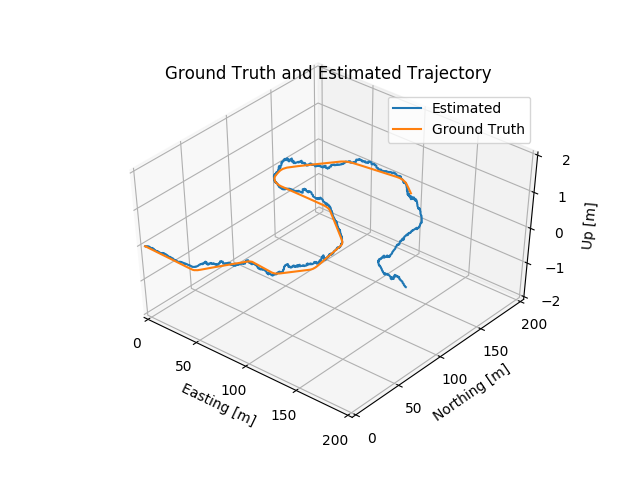
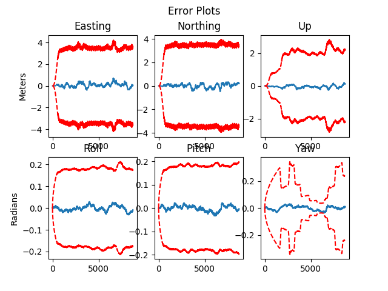
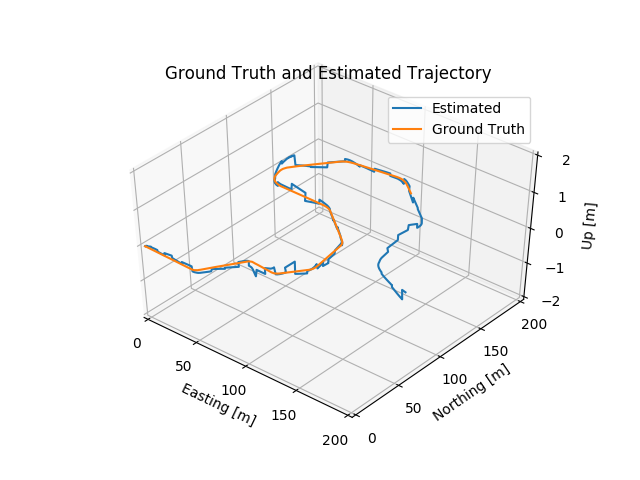
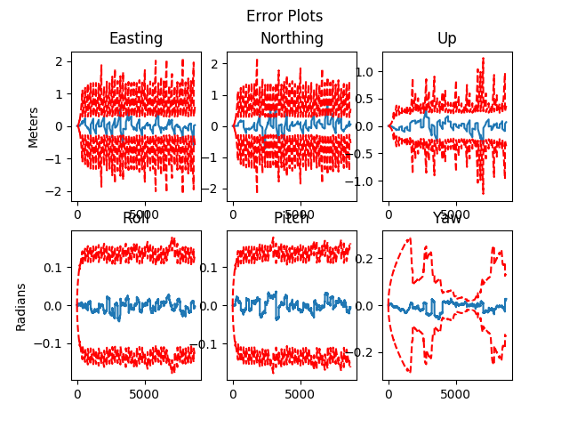
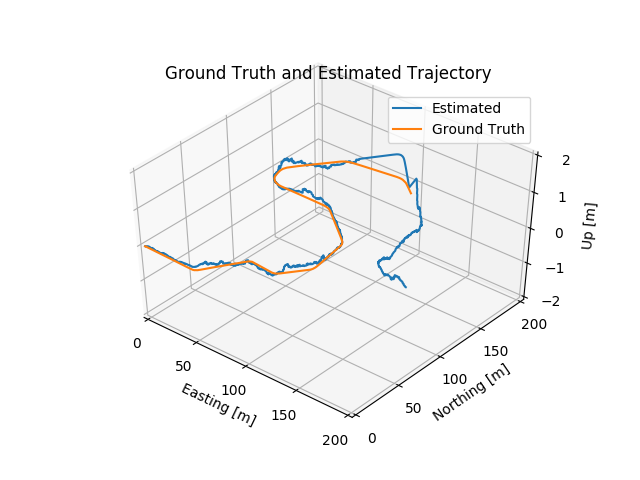
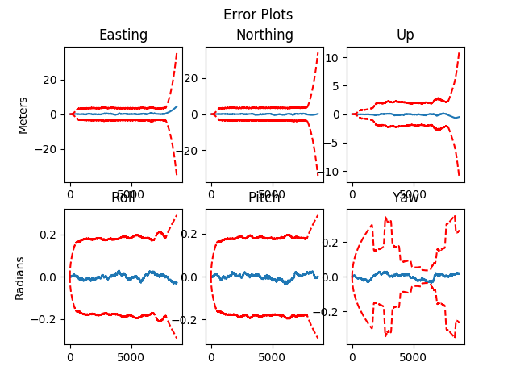

# Final Project: Multi-Sensor (IMU + Lidar) Fusion for Pose Estimation  <br />

## Results
* Part 1: Ideal case
<p align="center">
  
  
</p>

* Part 2: Sensor's poor calibration
<p align="center">
  
  
</p>

* Part 3: Sensor's infomation drops
<p align="center">
  
  
</p>


## Key Algorithms
* Conversion from **Euler angle** to **Quaternion**:
    ```python
    def to_euler(self):
        """Return as xyz (roll pitch yaw) Euler angles."""
        roll = np.arctan2(2 * (self.w * self.x + self.y * self.z), 1 - 2 * (self.x**2 + self.y**2))
        pitch = np.arcsin(2 * (self.w * self.y - self.z * self.x))
        yaw = np.arctan2(2 * (self.w * self.z + self.x * self.y), 1 - 2 * (self.y**2 + self.z**2))
        return np.array([roll, pitch, yaw])
    ```
    * check the provided util code [`rotations.py`](rotations.py)
    * Note: the function should be order sensitive, here it is implemented with a sequence ***roll-pitch-yaw***, but **WHY DO WE HAVE TO FOLLOW THIS ORDER**? Does someone have any idea about this?
* Quaternion multiplication:
    * As an example, the `quaternion left multiplication` looks like this:
    ```python
    def quat_mult_right(self, q, out='np'):
        """
        Quaternion multiplication operation - in this case, perform multiplication
        on the right, that is, q*self.

        :param q: Either a Quaternion or 4x1 ndarray.
        :param out: Output type, either np or Quaternion.
        :return: Returns quaternion of desired type.
        """
        v = np.array([self.x, self.y, self.z]).reshape(3, 1)
        sum_term = np.zeros([4,4])
        sum_term[0,1:] = -v[:,0]
        sum_term[1:, 0] = v[:,0]
        sum_term[1:, 1:] = -skew_symmetric(v)
        sigma = self.w * np.eye(4) + sum_term

        if type(q).__name__ == "Quaternion":
            quat_np = np.dot(sigma, q.to_numpy())
        else:
            quat_np = np.dot(sigma, q)

        if out == 'np':
            return quat_np
        elif out == 'Quaternion':
            quat_obj = Quaternion(quat_np[0], quat_np[1], quat_np[2], quat_np[3])
            return quat_obj
    ```
    * check the provided util code [`rotations.py`](rotations.py)
    * Note: it is critical to choose left or right multiplication for quaternions, because it impacts the **coordinate system** in consideration is *local* or *global* 

## Tips to Achieve Proper Results
* For all three parts of the project, following the [course slides](ESKF_Localization_by_Fusing_IMU_plus_Lidar.pdf) should be a great first step; the slides contain correct contexts and proper steps to achieve the final goal
* Make good use of functions from the provided [util code](rotations.py), although it is a great experience to implement all the functions by oneself, just as I did (sadly, there are still some critical mistakes, I'll fix them ASAP)
* If the mathematic terminaligy, **quaternion**, is a brand new friend of you (*just the same situation as I was in*), the two references I listed below would help you a lot to get farmiliar with it; in this course, the professor utilized the notations the same as [Sola's paper](https://arxiv.org/pdf/1711.02508.pdf), and [Jia's notes](http://graphics.stanford.edu/courses/cs348a-17-winter/Papers/quaternion.pdf) also provides a great tour to the topic.

## Reference
### Websites
* [How to convert between Euler angles and Quaternions](https://math.stackexchange.com/questions/2975109/how-to-convert-euler-angles-to-quaternions-and-get-the-same-euler-angles-back-fr)

### Papers & Textbooks & Slides
* [Localization and estimation using Error-State Kalman Filter](ESKF_Localization_by_Fusing_IMU_plus_Lidar.pdf)
* [Quaternion kinematics for the error-state Kalman filter, Sola, 2017](https://arxiv.org/pdf/1711.02508.pdf)
* [Quaternions and Rotations, Jia, 2013](http://graphics.stanford.edu/courses/cs348a-17-winter/Papers/quaternion.pdf)
